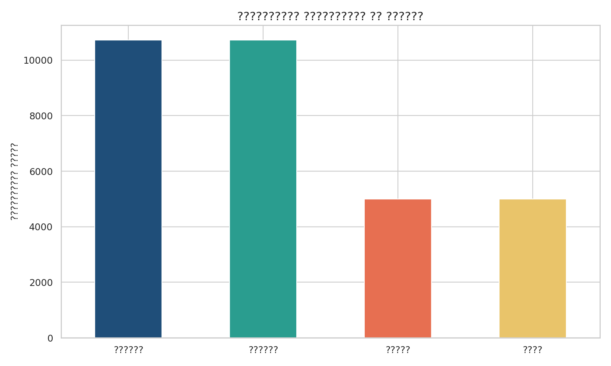
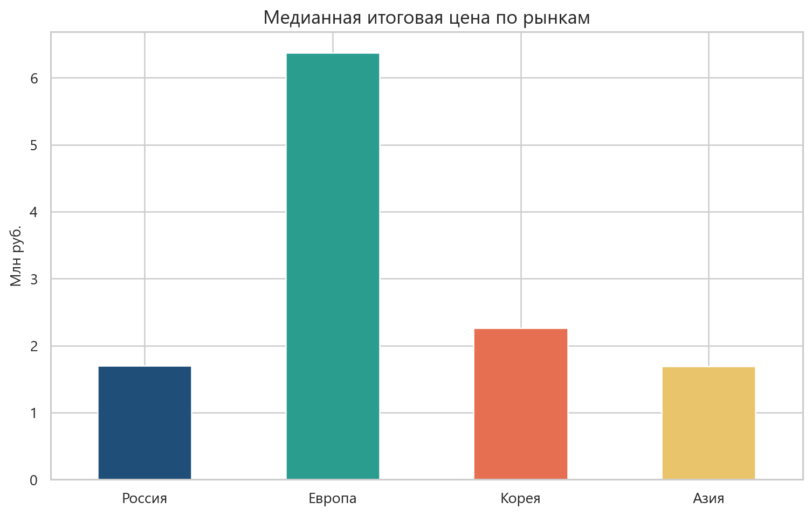
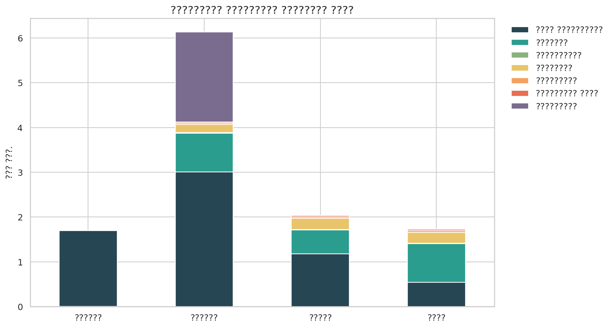
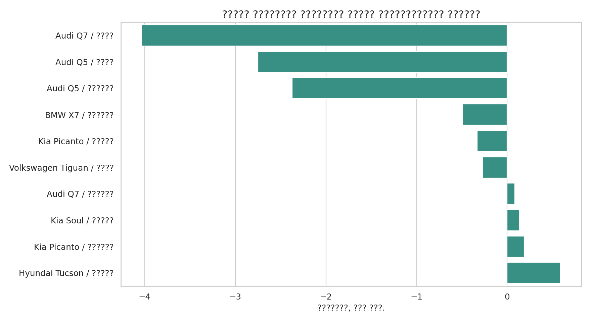

# Сравнение автомобильных рынков России, Европы и Азии

Мы посмотрели на задачу не только как на сбор данных, но и как на бизнес-кейс. Нам было важно понять, где сейчас реально выгоднее искать автомобили, если считать не только цену в объявлении, но и полную стоимость после ввоза в Россию.

В проекте мы собрали единый датасет по четырем направлениям:
- Россия
- Европа
- Корея
- другие страны Азии

Дальше мы привели все данные к одному виду, посчитали итоговую цену по одной логике и сравнили рынки между собой.

## 1. Бизнес-задача

Если смотреть только на цену объявления, можно сделать неправильный вывод. Зарубежный рынок часто выглядит дешевле, но после ввоза появляются дополнительные расходы:
- таможенная пошлина
- таможенный сбор за оформление
- доставка
- документы и сервисный сбор
- утильсбор

Поэтому наша бизнес-задача была такой: понять, на каких рынках и по каким моделям импорт действительно имеет смысл, а где выгоднее купить машину сразу в России.

### На какие вопросы мы хотели ответить

1. Где ниже итоговая цена после ввоза в Россию.
2. Какие марки и модели встречаются чаще всего на разных рынках.
3. В каких случаях импорт дает выгоду, а в каких нет.
4. Как именно складывается итоговая цена и какая статья расходов влияет сильнее всего.

## 2. Что у нас получилось по данным

На момент последней пересборки в проекте:

| Рынок | Количество строк |
|---|---:|
| Россия | 5 500 |
| Европа | 5 223 |
| Корея | 5 000 |
| Азия | 5 000 |
| Всего | 20 723 |

То есть мы собрали большой и сбалансированный датасет, где по каждому рынку есть 5000+ строк.

## 3. Бизнес-логика расчета цены

Мы считаем итоговую цену не через грубую наценку, а через понятные части:

`итоговая цена = цена объявления в рублях + пошлина + оформление + доставка + документы и сервис + утильсбор`

При этом:
- цена объявления переводится в рубли по курсам ЦБ РФ;
- пошлина считается по логике личного ввоза и зависит от возраста машины, объема двигателя и таможенной стоимости;
- оформление считается отдельно;
- доставка и документы считаются как отдельные фиксированные расходы по направлению;
- утильсбор зависит от возраста, объема и мощности.

Из-за этого итоговая цена в проекте стала заметно ближе к реальности и лучше подходит для нормального сравнения рынков.

## 4. Главные бизнес-выводы

### 4.1. Общая картина по рынкам

По медианной итоговой цене картина сейчас такая:

| Рынок | Медианная итоговая цена |
|---|---:|
| Азия | 1 689 560 руб. |
| Россия | 1 699 000 руб. |
| Корея | 2 258 814 руб. |
| Европа | 6 369 490 руб. |

Главный вывод здесь простой:
- Азия в среднем выглядит очень конкурентно;
- Россия остается сильным и понятным рынком;
- Корея уже не выглядит аномально дорогой, но и не всегда выигрывает;
- Европа чаще всего получается самой дорогой из-за более высокой цены самих машин и тяжелого утильсбора на мощные версии.





### 4.2. Из чего складывается итоговая цена

После обновления формулы стало видно, что у разных рынков разная структура итоговой стоимости:
- в России итоговая цена почти полностью равна цене объявления;
- в Азии и Корее заметную роль играют пошлина и доставка;
- в Европе сильно растет вклад утильсбора, потому что там в выборке много более дорогих и мощных машин.



### 4.3. Когда импорт действительно выгоден

В нашей сравнительной таблице сейчас есть 30 сопоставимых сценариев по моделям и рынкам:
- в 6 случаях импорт оказался дешевле покупки в России;
- в 24 случаях покупка в России оказалась выгоднее.

Самые интересные варианты для ввоза:
- `Audi Q7` из Азии
- `Audi Q5` из Азии
- `Audi Q5` из Европы
- `BMW X7` из Европы
- `Kia Picanto` из Кореи
- `Volkswagen Tiguan` из Азии

Самые слабые сценарии импорта:
- `Porsche Cayenne` из Европы
- `Porsche Panamera` из Европы
- `Porsche Panamera` из Азии
- `Toyota Camry` из Европы
- `Kia Sorento` из Кореи



### 4.4. Что это значит для бизнеса

Если говорить простыми словами, наш вывод такой:
- если задача стоит искать массовые и более доступные варианты, то Азия сейчас выглядит очень интересно;
- если нужен понятный и быстрый вариант без лишних расходов, российский рынок остается сильным;
- Корея интересна точечно, но не по всем моделям;
- Европа подходит скорее для отдельных дорогих моделей, и там надо очень внимательно считать итоговую стоимость, потому что расходы на ввоз быстро съедают выгоду.

## 5. Что лежит в репозитории

В репозитории мы оставили финальные файлы проекта и основной код:

- `cars_all.csv` — общий итоговый датасет по всем рынкам.
- `comparison_result.csv` — итоговая таблица сравнения с Россией по моделям.
- `GP_2_Project_Showcase.ipynb` — основной витринный ноутбук проекта.
- `GP_2_Scraping_&_API.ipynb` — рабочий ноутбук по сбору и анализу.
- `cars_pipeline.py` — общий запуск проекта.
- `cars_sources.py` — сбор данных из scraping-источников.
- `cars_api.py` — работа с API.
- `cars_dataset.py` — сбор общего датасета и сравнительной таблицы.
- `cars_import_costs.py` — расчет итоговой цены ввоза.
- `cars_normalization.py` и `cars_specs.py` — нормализация названий и характеристик.
- `cars_reporting.py` — таблицы, графики и готовые сводки.

Промежуточные кэши и временные файлы мы специально не храним в репозитории, чтобы он был чище.

## 6. Техническая часть

### 6.1. Откуда мы брали данные

| Направление | Источник | Способ |
|---|---|---|
| Россия | Auto.ru | Scraping |
| Европа | AutoScout24 | Scraping + Selenium |
| Корея | Encar API | API |
| Азия | TCV | Scraping |
| Характеристики моделей | API Ninjas | API с ключом |
| Курсы валют | ЦБ РФ | открытый API/XML |

То есть в проекте реально использованы и scraping, и API, причем на разных источниках внутри одной предметной области.

### 6.2. Что мы делаем с данными после сбора

После загрузки данных мы:
- приводим все таблицы к одной структуре;
- переводим цены в рубли;
- нормализуем названия марок и моделей;
- убираем разные языки и приводим ключевые поля к единому формату;
- достраиваем характеристики автомобилей, если они не были полностью заполнены;
- считаем итоговую цену ввоза;
- собираем общий датасет и отдельную сравнительную таблицу.

В результате в итоговом датасете ключевые поля `brand`, `model` и `model_key` хранятся в одном стиле и на одном языке.

### 6.3. Какие библиотеки мы использовали

Основной стек проекта:
- `pandas`
- `requests`
- `beautifulsoup4`
- `selenium`
- `matplotlib`
- `seaborn`
- `nbformat`
- стандартный `logging`

### 6.4. Как устроен расчет итоговой цены

Основная логика расчета лежит в файле `cars_import_costs.py`.

Мы разделили расчет на несколько шагов:

1. Берем цену объявления и переводим ее в рубли.
2. Считаем пошлину по возрасту машины, объему двигателя и стоимости.
3. Добавляем таможенный сбор за оформление.
4. Добавляем доставку.
5. Добавляем документы и сервисный сбор.
6. Добавляем утильсбор.
7. Складываем все в итоговую цену.

Такой подход нам был нужен, чтобы итоговая стоимость была прозрачной и чтобы каждый элемент можно было отдельно показать в EDA.

### 6.5. Как запустить проект

Если нужно просто посмотреть результаты:
- открыть `GP_2_Project_Showcase.ipynb`
- открыть `cars_all.csv`
- открыть `comparison_result.csv`

Если нужно пересобрать проект:

1. Установить нужные библиотеки.
2. При необходимости записать ключ в `.env`:

```env
API_NINJAS_KEY=ваш_ключ
```

3. Запустить пайплайн:

```bash
python cars_pipeline.py
```

4. После этого можно открыть ноутбук `GP_2_Project_Showcase.ipynb` и заново пройти весь проект.

## 7. Что мы считаем сильной стороной проекта

Мы бы выделили такие сильные стороны:
- большой объем данных;
- четыре рынка в одной задаче;
- одновременное использование scraping и API;
- единая нормализация марок и моделей;
- понятный расчет полной цены ввоза;
- подробный EDA не только по ценам, но и по структуре расходов;
- итоговые выводы, которые можно объяснить простыми словами.

## 8. Итог

Для нас этот проект получился не просто про парсинг сайтов. Мы постарались собрать данные так, чтобы из них можно было сделать нормальный прикладной вывод.

Главный итог для бизнеса у нас такой: смотреть только на цену объявления нельзя. Если считать полную стоимость честно, то самые интересные возможности чаще появляются в Азии и в отдельных точечных сценариях, а Европа без аккуратного расчета часто выглядит заметно дороже.

## Использование нейросетей в проекте

Нейросеть в нашем проекте использовалась только как вспомогательный инструмент. Мы не использовали её для генерации строк датасета, подмены источников, автоматического расчета итогов без проверки или написания выводов без опоры на данные. Все финальные решения по коду, формулам, очистке данных и интерпретации результатов мы проверяли вручную.

### Где и как использовалась нейросеть

- `cars_api.py`  
  Для чего: чтобы быстрее разобраться с документацией API и не тратить лишнее время на ручной поиск примеров запросов.  
  В каком виде: нейросеть помогала кратко объяснить структуру API, подсказать формат заголовков, параметры запросов и общий вид ответа.

- `cars_sources.py`  
  Для чего: чтобы предварительно оценить, какие источники вообще подходят под нашу задачу по автомобилям и какие из них реально можно использовать в проекте.  
  В каком виде: нейросеть использовалась как помощник при первичной проверке релевантности площадок, сравнении источников и выборе направлений для scraping.

- `cars_normalization.py`  
  Для чего: чтобы подготовить черновые идеи по объединению разных написаний марок и моделей в один формат.  
  В каком виде: нейросеть помогала предлагать варианты алиасов, транслитераций и объединения похожих названий, которые мы потом вручную проверяли и дорабатывали.

- `cars_text.py`  
  Для чего: чтобы аккуратнее привести текстовые поля к одному языку и одному стилю.  
  В каком виде: нейросеть помогала с идеями по очистке текста, транслитерации, нормализации названий и обработке нестандартных вариантов написания.

- `cars_import_costs.py`  
  Для чего: чтобы быстрее сориентироваться в документации и общей логике расчета ввоза автомобиля в Россию.  
  В каком виде: нейросеть использовалась как помощник при поиске и структурировании правил расчета, после чего сама формула отдельно проверялась, уточнялась и тестировалась на наших данных.

- `cars_reporting.py`  
  Для чего: чтобы сделать анализ более наглядным и не упустить важные срезы в EDA.  
  В каком виде: нейросеть помогала предлагать идеи для таблиц, графиков и сравнений по рынкам, маркам, моделям и структуре итоговой цены.

- `GP_2_Project_Showcase.ipynb`  
  Для чего: чтобы оформить основной блокнот проекта более понятно и последовательно.  
  В каком виде: нейросеть использовалась для помощи в структуре разделов, формулировках пояснений и идеях по подаче результатов простым языком.

- `GP_2_Scraping_&_API.ipynb`  
  Для чего: чтобы сделать рабочий блокнот более чистым, логичным и удобным для защиты.  
  В каком виде: нейросеть помогала с идеями по порядку блоков, пояснениям после кода и общей подаче этапов проекта.

- `README.md`  
  Для чего: чтобы оформить описание проекта в понятном и аккуратном виде.  
  В каком виде: нейросеть использовалась как помощник в структурировании текста, упрощении формулировок и подготовке черновиков описания бизнес- и технической части.


### Итог

Мы использовали нейросеть только там, где она могла ускорить подготовительную и вспомогательную работу: поиск документации, первичный отбор источников, черновые идеи по нормализации, структуре анализа и оформлению проекта. Все содержательные части проекта — сбор данных, расчеты, очистка, проверка и бизнес-выводы — мы контролировали и проверяли самостоятельно.
Также использовали Claude для проверки на соответствие всем критериям проекта.
